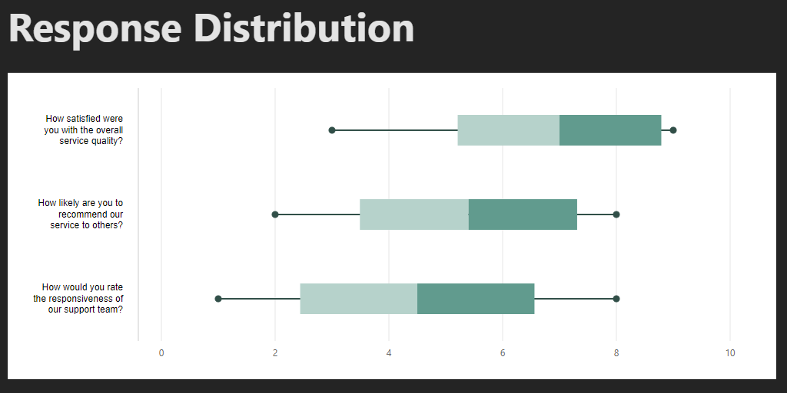

# Horizontal Box Plot

A React component for rendering horizontal box plots with customizable styles and data visualization.



## Usage

### Getting Started

1. Clone this repository
2. Run `npm install` to install dependencies
3. Run `npm run dev` to start the development server
4. View the example implementation at `http://localhost:5173`

### Implementation Example

```jsx
import { HorizontalBoxPlot } from './components/HorizontalBoxPlot';

function App() {
  const data = {
    min: 10,
    q1: 20,
    median: 35,
    q3: 45,
    max: 60,
    mean: 33
  };

  return (
    <HorizontalBoxPlot 
      data={data}
      width={400}
      height={100}
      color="#4287f5"  // Primary color
    />
  );
}
```

### Props

| Prop | Type | Description |
|------|------|-------------|
| `data` | `object` | Object containing statistical values (min, q1, median, q3, max, mean) |
| `width` | `number` | Width of the component in pixels |
| `height` | `number` | Height of the component in pixels |
| `color` | `string` | Primary color for the box plot (hex or color name) |
| `showMean` | `boolean` | Toggle mean marker visibility (default: true) |
| `showOutliers` | `boolean` | Toggle outlier points visibility (default: true) |

## Roadmap

- [ ] Improved color scheme handling:
  - Automatic derivation of complementary colors from a single primary color
  - Consistent color palette for box, whiskers, and markers
  - Better contrast handling for mean and outlier markers